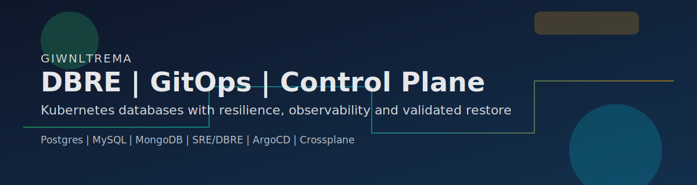

  
  

  

  

  
  
  
  
  
  

# giwnltrema

DBRE focused on database resilience, automation, and GitOps platform operations to reduce DBA/SRE toil.

## Quick Index

- [Quick summary](#quick-summary)
- [Projects I am actively building](#projects-i-am-actively-building)
- [Core stack](#core-stack)
- [Operating flow](#operating-flow)
- [Metrics and visuals](#metrics-and-visuals)
- [Contact](#contact)

## Quick summary

| Pillar | What I deliver | Expected outcome |
|---|---|---|
| DBRE | Standardized clustered databases on Kubernetes | Lower outage risk |
| GitOps | PR-driven provisioning with policies and audit trail | Less manual change and fewer errors |
| Backup/DR | Continuous backups + validated restore | Real, measurable RTO/RPO |
| Observability | Dashboards, alerts, and query insights | Faster diagnosis and lower toil |

## Projects I am actively building

| Project | Status | Current focus | Link |
|---|---|---|---|
| `dbre-control-plane` | Building | Kubernetes control plane for databases with integrated backup/restore and observability | [open](https://github.com/giwnltrema/dbre-control-plane) |
| `terrariadosbobo` | Evolving | GitOps + observability + automation reference implementation | [open](https://github.com/giwnltrema/terrariadosbobo) |
| `banco-cheatsheet` | Active | Practical DB operations and troubleshooting knowledge base | [open](https://github.com/giwnltrema/banco-cheatsheet) |

## Core stack

| Area | Technologies |
|---|---|
| Databases | MongoDB, Postgres, MySQL |
| Kubernetes DB | Patroni, PXC/ProxySQL, database operators |
| Cloud/Infra | AWS, Kubernetes, Terraform, Helm, Crossplane |
| GitOps | ArgoCD, declarative repos, continuous reconciliation |
| Observability | Prometheus, Grafana, Loki, Alertmanager |
| Automation | Python, PowerShell, Bash, GitHub Actions |

## Operating flow

| Step | How it works |
|---|---|
| 1. Definition | Database resources and policies are versioned in Git |
| 2. Delivery | ArgoCD applies declarative changes to clusters |
| 3. Runtime | Operators deploy resilient clusters and wire proxies/exporters |
| 4. Reliability | Backup and restore validation are continuously monitored |
| 5. Operations | Dashboards and alerts expose health, cost, and performance |

## Metrics and visuals

  

  
  

  

  

  

  <picture>
    <source media="(prefers-color-scheme: dark)" srcset="https://raw.githubusercontent.com/giwnltrema/giwnltrema/output/github-snake-dark.svg" />
    <source media="(prefers-color-scheme: light)" srcset="https://raw.githubusercontent.com/giwnltrema/giwnltrema/output/github-snake.svg" />
    
  </picture>

## Contact

  
  
  

