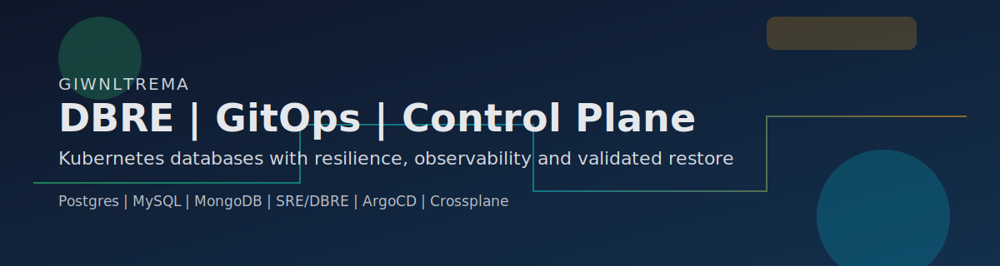
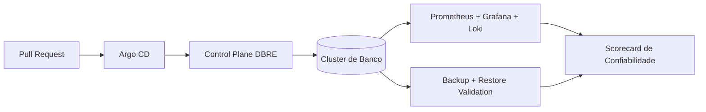

  
  

  

  

  
  
  
  
  
  

# giwnltrema

DBRE com foco em resiliencia de bancos, operacao GitOps e automacao de plataforma para reduzir toil de DBA/SRE.

## Sumario

- [O que voce encontra aqui](#o-que-voce-encontra-aqui)
- [Arquitetura de trabalho](#arquitetura-de-trabalho)
- [Agora](#agora)
- [Especialidades tecnicas](#especialidades-tecnicas)
- [Projeto em foco](#projeto-em-foco)
- [MongoDB highlights](#mongodb-highlights)
- [Metricas do perfil](#metricas-do-perfil)
- [Contato](#contato)

## O que voce encontra aqui

| Area | Entrega |
|---|---|
| DBRE | Padroes para bancos clusterizados em Kubernetes com foco em RTO/RPO e failover seguro |
| GitOps | Fluxo de provisionamento por PR com ArgoCD, policies e trilha auditavel |
| Observabilidade | Dashboards, alertas e query insights para enxergar lag, lock, custo e saude real |
| Backup/DR | Backup continuo com restore validado para evitar risco oculto |

## Arquitetura de trabalho

## Agora

- Construindo um control plane DBRE para Kubernetes com composicoes, policies e onboarding rapido.
- Padronizando backup por engine com restore de validacao e telemetria de sucesso.
- Estruturando um caminho de produto no modelo open-core + camada SaaS.

## Especialidades tecnicas

| Pilar | Stack principal |
|---|---|
| Bancos | MongoDB, Postgres, MySQL |
| Kubernetes DB | Patroni, PXC/ProxySQL, operadores de banco |
| Cloud/Infra | AWS, Kubernetes, Terraform, Helm, Crossplane |
| GitOps | ArgoCD, repos declarativos, pipelines de reconciliacao |
| Observabilidade | Prometheus, Grafana, Loki, Alertmanager |
| Automacao | Python, PowerShell, Bash, GitHub Actions |

## Projeto em foco

- [`dbre-control-plane`](https://github.com/giwnltrema/dbre-control-plane): visao de plataforma para bancos clusterizados com GitOps, observabilidade integrada e backup validado.
- [`terrariadosbobo`](https://github.com/giwnltrema/terrariadosbobo): referencia visual e pratica de stack orientada a operacao, metricas e GitOps.

## MongoDB highlights

- Operacao de replica set e shard com foco em estabilidade e padrao operacional.
- Backup/restore com verificacao periodica e monitoramento de freshness.
- Tuning de performance com indices, profiler e analise de workload.
- Planejamento de resiliencia com game days e validacao de failover.

## Metricas do perfil

  
  

  

  

  <picture>
    <source media="(prefers-color-scheme: dark)" srcset="https://raw.githubusercontent.com/giwnltrema/giwnltrema/output/github-snake-dark.svg" />
    <source media="(prefers-color-scheme: light)" srcset="https://raw.githubusercontent.com/giwnltrema/giwnltrema/output/github-snake.svg" />
    
  </picture>

## Contato

  
  
  

